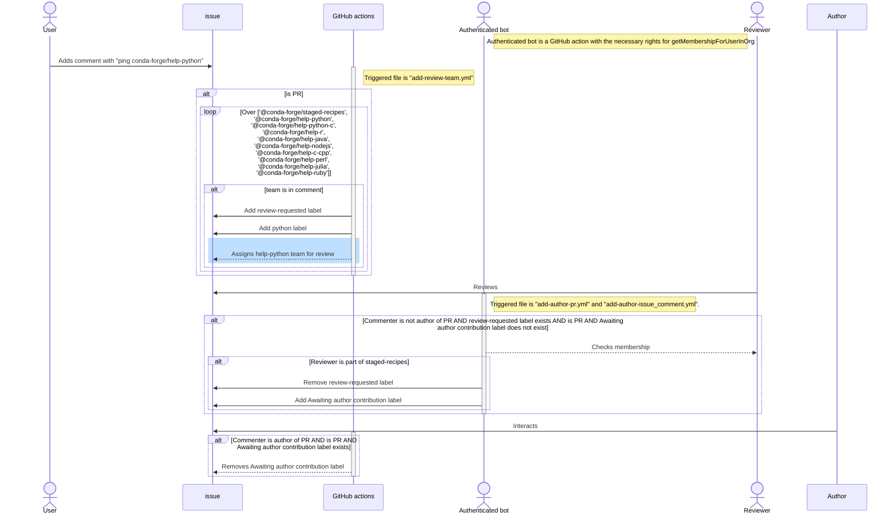

# test-labeler

Test the conda-forge/staged-recipes actions.

The workflow is the following:

```mermaid
sequenceDiagram
    actor User
    participant issue
    participant GitHub actions
    actor Authenticated bot
    actor Reviewer
    Note right of Authenticated bot: Authenticated bot is a GitHub action with the necessary rights for getMembershipForUserInOrg
    User->>issue: Adds comment with "ping conda-forge/help-python"
    activate GitHub actions
    Note right of GitHub actions: Triggered file is "add-review-team.yml"
    alt is PR
        loop Over ['@conda-forge/staged-recipes', '@conda-forge/help-python', '@conda-forge/help-python-c', '@conda-forge/help-r', '@conda-forge/help-java', '@conda-forge/help-nodejs', '@conda-forge/help-c-cpp', '@conda-forge/help-perl', '@conda-forge/help-julia', '@conda-forge/help-ruby']
            alt team is in comment
                GitHub actions->>issue: Add review-requested label
                GitHub actions->>issue: Add python label
                rect rgb(191, 223, 255)
                    GitHub actions-->>issue: Assigns help-python team for review
                end 
            end 
        end
    end
    deactivate GitHub actions
    Reviewer->>issue: Reviews
    activate Authenticated bot
    Note right of Authenticated bot: Triggered file is "add-author-pr.yml" and "add-author-issue_comment.yml".
    alt Commenter is not author of PR AND review-requested label exists AND is PR AND Awaiting author contribution label does not exist
        Authenticated bot-->>Reviewer: Checks membership
        alt Reviewer is part of staged-recipes
            Authenticated bot->>issue: Remove review-requested label
            Authenticated bot->>issue: Add Awaiting author contribution label
        end 
    end
    deactivate Authenticated bot
    Author->>issue: Interacts
    activate GitHub actions
    alt Commenter is author of PR AND is PR AND Awaiting author contribution label exists
        GitHub actions-->>issue: Removes Awaiting author contribution label
    end
    deactivate GitHub actions
```

_Note_: The blue part is proposed and not actually integrated yet.
